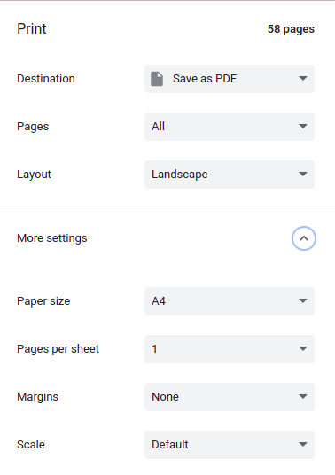
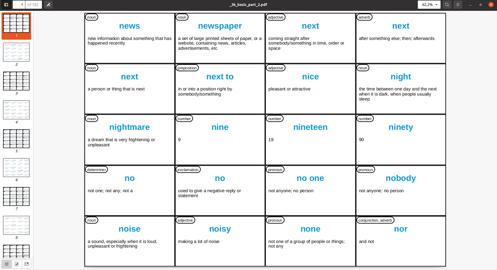
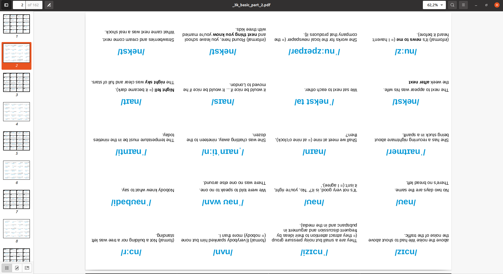
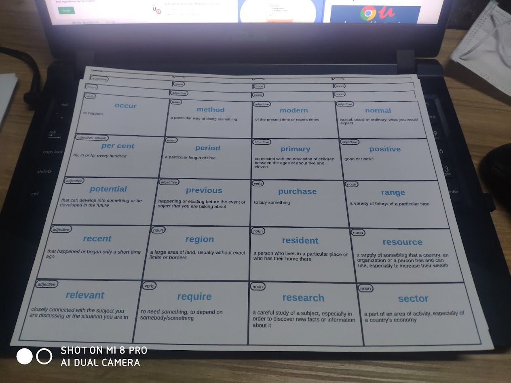
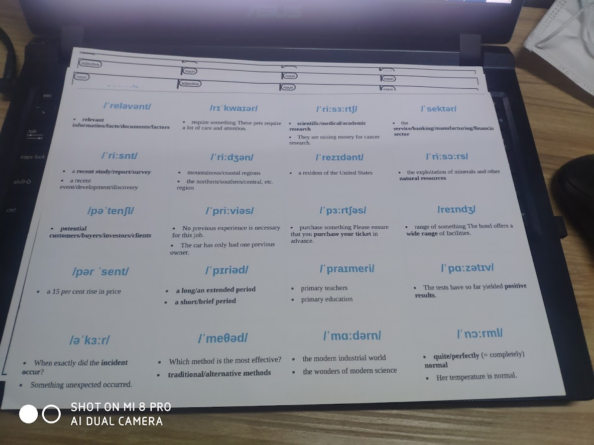
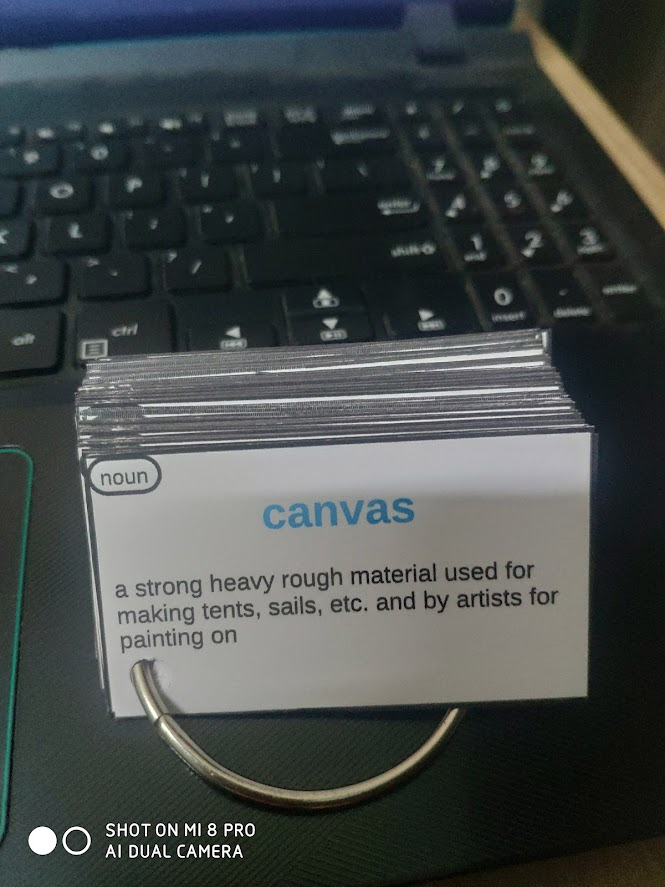
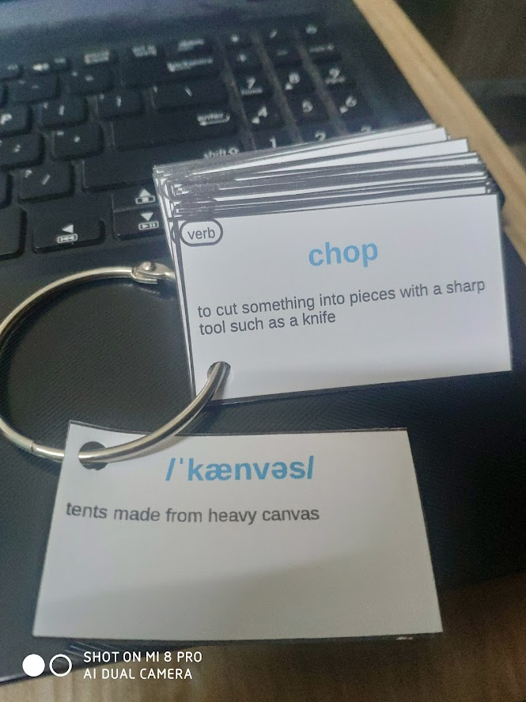
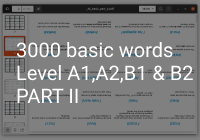
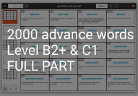
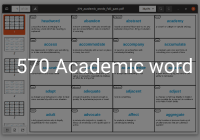

Flashcard là một trong nhữnng phương pháp học từ vựng nhanh và hiệu quả nhất hiện nay. Thế nhưng để tự viết flashcard lên giấy thì sẽ tốn rất nhiều thời gian do đó mình đã tạo ra file PDF của flash các từ vựng thông dụng để tối ưu hóa và tăng tốc độ trong quá trình học từ vựng.
### Vấn đề và giải pháp

##### Vấn đề

Mình muốn học từ vựng bằng phương pháp sử dụng flashcard giấy vì nó dễ dàng để áp dụng phương pháp [lặp lại ngắt quãng](#) và [không bỏ sót từ](#) để tăng năng suất học tập. Ngoài ra mình có thể dễ dàng mang đi theo cạnh người và thỉnh thoảng lấy ra để dò lại, và nguyên nhân quan trọng nhất là mình có thể dễ dàng tập trung hơn khi sử dụng ứng dụng trên điện thoại/máy tính. Từ đây ta có yêu cầu là tạo ra file PDF của các từ vựng trên nền giấy A4 từ một danh sách từ của người dùng để người dùng in ra và cắt ra thành từng tấm flashcard nhỏ.

##### Giải pháp

**Bước 1:** là lựa chọn về từ điển để thu thập dữ liệu thì mình chọn [OALD](https://www.oxfordlearnersdictionaries.com/) - từ điển Anh-Anh nổi tiếng của Oxford. Đầu vào là từ ngữ mình tìm kiếm và sẽ trả về là định nghĩa, ví dụ, loại từ, phát âm.

**Bước 2:** là làm sao để tạo ra flashcard PDF từ file text được crawl từ Oxford? Tại đây thì mình nghĩ về sử dụng HTML và chế độ in của trình duyệt (Chrome). Tức có nghĩa nếu mình thiết kế file HTML vừa khít với kích thước tờ A4 thì khi thực hiện in trên trình duyệt sẽ trả về cho mình một file PDF mà khi in ra sẽ vừa với một tờ A4.

**Bước 3:** là thiết kế  giao diện cho flashcard. Dựa theo cách mình đã học thì mình có thiết kế [giao diện như sau trên Figma](https://www.figma.com/file/Bo5KWQFiWcuZRTCA6oM7lE/Untitled?node-id=0%3A1) sau đó nhờ bạn code file HTML dùm.(Lâu lắm rồi mình không code HTML :()

**Bước 4:** viết một Python script để tự động tạo file HTML(chứa nhiều flashcard) và chèn các dữ liệu được crawl từ Oxford về vào trong file HTML đó.

**Bước 5:** mở file HTML được tạo bằng trình duyệt duyệt Chrome và và xuất trang đó dưới dạng PDF.

### Hướng dẫn sử dụng code
**Yêu cầu:**
Có môi trường Python đã được cài đặt

**Bước1** Clone [repo này](https://github.com/Huythanh0x/create_printable_oxford_flashcard) về  **hoặc** download dưới dạng zip và unzip

**Bước2** Dán danh sách cách từ và bạn muốn tạo flashcard vào `input_word_list/word_list.txt`. Các từ nằm riêng biệt trên các dòng khác nhau và các từ này phải là các từ đơn.(nếu từ nào mà chưa ký tự đặc biệt hoặc khoảng cách thì sẽ bị bỏ qua và tiếp tục chạy các dòng còn lại)

**Bước3** Chạy script bằng lệnh `python3 main.py`. Qúa trình này sẽ mất một khoảng thời gian tùy vào số lượng danh sách từ của bạn.

**Bước4** Mở file `output_html/my_custom_wordlist.html` bằng google Chrome

**Bước5** Bước này khá quan trọng. Bạn chọn vào chế độ in bằng cách ấn tổ hợp phím `Ctrl + P`.Sau đó chỉnh destination là `save as PDF`, layout sang `landscape`, margin là `None` như hình dưới.

Cuối cùng thì ta đem file PDF này ra tiệm để in thôi. Bạn nên đọc một số lưu ý phía dưới trước khi đem đi in. 

### Một khó khăn trong quá trình code và kết quả

##### Một số khó khăn trong quá trình code

- Mình cần chừa lại một ô vuông ô dưới cùng bên trái để xỏ khoen, nếu sử dụng `len(text)` thì không khả dụng do chiều dài của các chữ các khác nhau là khác nhau. Từ đó mình tìm cách đo chiều dài thực tế của các chữ cái nhờ vào thư viện `fontTools`.
- Kích thước A4 của Google khác với kích thước của A4 thực tế nên dù cho khi xuất file PDF rất khít nhưng khi in lại bị lệch theo chiều ngang - margin bên trái khác margin bên phải dẫn tới bị lệch giữa mặt trước và mặt sau. Từ đó sẽ mất chữ sau khi cắt nhỏ flashcard. Sẽ fix được khi in màu.
- Nếu số lượng từ quá lớn (từ 2500 từ)thì trong quá trình xuất file PDF từ HTML sẽ bị lỗi. Cách khắc phục là chia nhỏ HTML thành các phần khác nhau.
- Một từ có thể có nhiều ví dụ có độ dài ngắn khác nhau. Ví dụ có thể chỉ là 1 phrase 3 từ hoặc cả câu 3 dòng. Giải quyết bằng cách nếu từ ngắn thì sử dụng 2 ví dụ nếu từ dài thì chỉ dùng 1 ví dụ cho 1 flashcard.

##### Kết quả

Đây là hình ảnh file PDF trên máy tính

Và đây là hình ảnh thực tế sau khi mình in ra

Còn đây là hình ảnh sau khi hoàn thiện các bước

### Một số lưu ý khi sử dụng PDF này
- Và phải in trên giấy cứng, tối thiểu định lượng giấy in là **180gsm** và khuyến nghị định lượng nên là từ **300gsm**
- Phải cắt bằng tay nên có thể lệch, nếu bạn có bàn cắt thì sẽ nhanh và ngay ngắn hơn.
- Phải bấm lỗ để xỏ khoen bằng tay, khá là đau tay :(
- Có một *tỉ lệ rất nhỏ* là khi in sẽ bị lệch 1 dòng do máy in bị lệch trong quá trình cuộn giấy.
- Khi in đen trắng thì có *khả năng cao* là sẽ bị lệch giữa hai mặt, gây đến mất chữ, nên mình khuyến nghị nên in màu hoặc in trước 1 tờ để kiểm tra độ khớp giữa mặt trước và mặt sau.
- và nếu muốn xâu flash card thành chuỗi thì bạn cần mua thêm [kìm bấm lỗ`](https://shopee.vn/K%C3%ACm-b%E1%BA%A5m-l%E1%BB%97-i.8865912.149324473) và  [khoen tròn flashcard](https://www.google.com/search?q=khoen+v%C3%B2ng+flashcard&sxsrf=APq-WBts2jGsQGqAN3-27ekYe4qBSrD0kQ:1647415400663&source=lnms&tbm=shop&sa=X&ved=2ahUKEwiS0oPOjMr2AhXIyYsBHc0yCfQQ_AUoAHoECAIQCQ&biw=1745&bih=806&dpr=1.1)

### Link tải một số file PDF đã được chuẩn bị sẵn

<!-- 
 -->

<!-- 
 -->

### Tài liệu tham khảo
[Trang chủ Oxford](https://www.oxfordlearnersdictionaries.com/wordlists/oxford3000-5000)